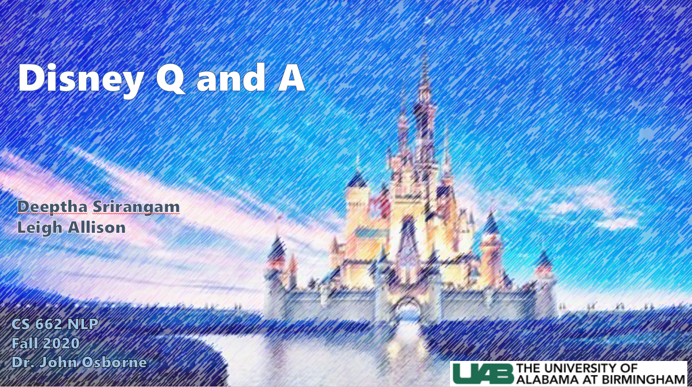

# Disney Q & A
## UAB Fall 2020 CS 662 NLP 
The purpose of this project is to create a model that can answer questions about Disney World and Disney Land


## Authors

Deeptha Srirangam (MS Data Science student)

Leigh Allison (MS Data Science student)




## Installation
```python
pip install git+https://github.com/uabinf/nlp-group-project-fall-2020-disneyqanda
```
## Usage
```python
import disneyqanda
```

## Directory Structure
```bash
|-disneyqanda
|   |-disneyqanda.py (main file to run program)
|   |-data
|   |   |-ans_type_classifier (nltk Naive Bayes classification model)
|   |   |-doc2vec.model (gensim Doc2Vec model trained on qna.txt)
|   |   |-DisneyEntities.csv (custom Disney entity list)
|   |   |-qna.txt (Q and A data from Disney)
|   |   |-Question_AnswerType.csv (labeled data for training ans_type_classifier)
|   |-data_collection
|   |-local_dependencies
|   |   |-question.py (question object code)
|   |   |-document_processing.py (doc processing driver code)
|   |   |-answer_processing.py (answer processing driver code)
|   |   |-quest_processing
|   |   |   |-answer_type.py
|   |   |   |-focus.py 
|   |   |   |-key_words.py
|   |   |-doc_processing
|   |   |   |-document_retrieval.py
|   |   |   |-document_segmentation.py
|   |   |   |-passage_ranking.py
|   |   |   |-passage_retrieval.py
|   |   |-ans_processing
|   |   |   |-ner_tagger.py
|   |   |   |-candidate_answer.py
|   |   |   |-candidate_ranking.py
```
